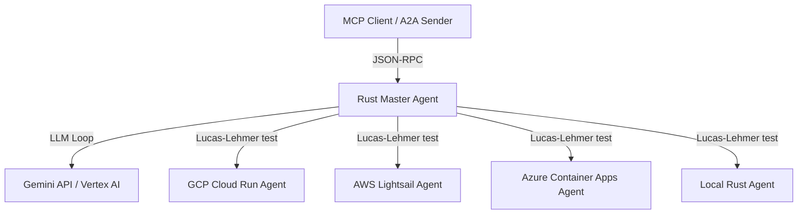

# Rust A2A Multi-Cloud Benchmark Setup

This repository contains a Rust-only implementation of a multi-agent system using the **Agent-to-Agent (A2A)** protocol and **Model Context Protocol (MCP)**. It features a central **Rust Master Agent** that coordinates prime calculations and benchmarks by delegating tasks to dedicated Rust sub-agents running locally or deployed across GCP, AWS, and Azure.

---

## 📌 System Architecture

The following diagram illustrates how the MCP clients or A2A senders interact with the Master Coordinator Agent, and how the Master Coordinator distributes tasks to the local and remote sub-agents:



---

## 📂 Project Structure

The project is organized into several directories and key workspace files:

- **[rust-master/](file:///home/xbill/a2a-multicloud/rust-master/)**: The master coordinator agent. It runs an MCP/A2A server that exposes tools to calculate Mersenne primes and check exponent primality by calling sub-agents. See [rust-master/src/main.rs](file:///home/xbill/a2a-multicloud/rust-master/src/main.rs) for implementation details.
- **[benchmark-rust/](file:///home/xbill/a2a-multicloud/benchmark-rust/)**: The local Rust sub-agent implementation for prime calculation. See [benchmark-rust/src/main.rs](file:///home/xbill/a2a-multicloud/benchmark-rust/src/main.rs) for implementation details.
- **[benchmark-rust-aws/](file:///home/xbill/a2a-multicloud/benchmark-rust-aws/)**: The AWS Lightsail deployment configuration and integration tests for the Rust prime agent.
- **[benchmark-rust-gcp/](file:///home/xbill/a2a-multicloud/benchmark-rust-gcp/)**: The Google Cloud Run deployment configuration and integration tests for the Rust prime agent.
- **[benchmark-rust-azure/](file:///home/xbill/a2a-multicloud/benchmark-rust-azure/)**: The Azure Container Apps deployment configuration and integration tests for the Rust prime agent.

### Execution, Automation & Diagnostics Scripts
- **[Makefile](file:///home/xbill/a2a-multicloud/Makefile)**: Central automation command definitions.
- **[a2a-master-rust.sh](file:///home/xbill/a2a-multicloud/a2a-master-rust.sh)**: Sourced script that runs the Rust master coordinator agent locally.
- **[set_env.sh](file:///home/xbill/a2a-multicloud/set_env.sh)**: Configures standard GCP environment variables and public URL endpoints for deployed cloud agents.
- **[set_adc.sh](file:///home/xbill/a2a-multicloud/set_adc.sh)**: Helper to configure Google Application Default Credentials (ADC).
- **[init.sh](file:///home/xbill/a2a-multicloud/init.sh)**: Initializer to configure project environments, Google Cloud services, and local credentials.
- **[inspect.sh](file:///home/xbill/a2a-multicloud/inspect.sh)**: Runs the A2A Inspector tool.

---

## 🛠️ Key Commands

> [!IMPORTANT]
> Always source the environment variables before running any `make` commands:
> ```bash
> source ./set_env.sh
> ```

### 1. Build Targets
- **Build Development (Debug)**: Compiles master and local agents.
  ```bash
  make build
  ```
- **Build Production (Release)**: Compiles master, local, and sub-agents in release mode.
  ```bash
  make release
  ```

### 2. Execution
- **Start Master Agent**: Launches the local Rust master coordinator on `http://0.0.0.0:8100`.
  ```bash
  make start
  ```

### 3. Verification & Diagnostics
- **Check Health Status**: Query status and check connection health for all sub-agents (AWS, GCP, Azure, and Local).
  ```bash
  make status
  ```
- **A2A Status Query**: Query calculation status using the A2A JSON-RPC protocol (`message/send` with a `status` payload).
  ```bash
  make a2a                 # Defaults to Local Agent
  make a2a AGENT=azure     # Target Azure Remote Agent
  make a2a AGENT=all       # Check status across all agents
  ```
- **Endpoint Query**: Fetch local/public endpoint URLs for configured agents.
  ```bash
  make endpoint            # Lists all agent endpoints
  make endpoint AGENT=gcp  # Fetch specific agent endpoint
  ```
- **Fetch Agent Card**: Retrieve agent capabilities and information JSON (`/.well-known/agent-card.json`).
  ```bash
  make card                # Defaults to Master Coordinator
  make card AGENT=local    # Fetch local benchmark agent capabilities
  make card AGENT=all      # Fetch card for all agents
  make card AGENT=https://example.com # Query custom endpoint
  ```

### 4. Running Tests
- **Unit Tests**: Runs tests across the Rust modules.
  ```bash
  make test
  ```
- **Integration Tests**: Executes end-to-end cloud A2A integration test runners.
  ```bash
  make test-aws
  make test-gcp
  make test-azure
  ```

---

## ⚙️ How It Works

### 1. Agent-to-Agent (A2A) Protocols & Security
- Sub-agents communicate using the standardized A2A JSON-RPC interface over HTTP/HTTPS.
- They implement `GET /.well-known/agent-card.json` (aliases to `/.well-known/agent.json`) for advertising features, and accept `POST /` with `message/send` requests.
- **GCP Authentication**: Sub-agent requests targeting Google Cloud Run require OIDC identity tokens. The coordinator dynamically resolves this token using Application Default Credentials (ADC) or local gcloud environments via `get_gcp_id_token()`.

### 2. Model Context Protocol (MCP) Server
The **[rust-master/](file:///home/xbill/a2a-multicloud/rust-master/)** coordinator acts as a standard-compliant MCP server.
- Supports both standard input/output (`--stdio`) transport and HTTP transport (`/mcp` endpoint).
- Exposes three key tools:
  - `ask_master_agent(query: String)`: Ask the master agent a question (evaluates using the internal Gemini API coordinator loop).
  - `calculate_mersenne_prime(n: i64)`: Initiates a distributed benchmark from exponent $1$ to $n$.
  - `check_agents_status()`: Diagnostics tool querying status/health of all agents.

### 3. Distributed Mersenne Prime Benchmarks
- When calling `calculate_mersenne_prime`, the coordinator loops through exponents up to $n$ and schedules ready sub-agents to test primality using the **Lucas-Lehmer primality test**.
- Detailed telemetry is logged to the dashboard and saved into **[benchmark_results.json](file:///home/xbill/a2a-multicloud/benchmark_results.json)** along with timestamped archive JSON files.
