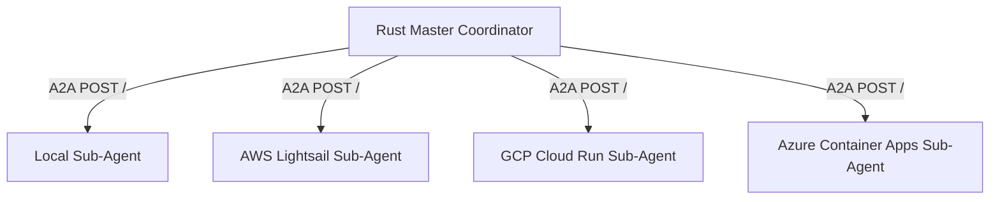

# Gemini Workspace for `benchmark-rust-gcp`

Welcome! This guide is designed for AI coding assistants working in the `benchmark-rust-gcp` sub-project of the Multi-Cloud A2A (Agent-to-Agent) Prime Calculation Benchmark system.

---

## 1. Role and Context
You are a Rust developer working within a multi-cloud agent structure. This directory hosts the **Google Cloud Run (GCP)** agent. 

### Multi-Cloud Coordinator Flow


The coordinator (`rust-master`) calls this sub-agent to:
1. Query its status / readiness before distributing tasks.
2. Delegate exponent validation (specifically Lucas-Lehmer primality tests).
3. Record benchmarks for distributed calculations.

---

## 2. Key Codebase Components

### Entrypoint and Routes: [src/main.rs](file:///home/xbill/a2a-multicloud/benchmark-rust-gcp/src/main.rs)
- **HTTP Server**: Uses Axum and Tokio listener.
- **Routes**:
  - `GET /health`: Basic ping returning `OK`.
  - `GET /.well-known/agent.json` and `GET /.well-known/agent-card.json`: Returns capability information (skills list).
  - `POST /`: JSON-RPC endpoint. Handles method `message/send`.
- **State management**:
  - Uses `AtomicBool` `CALCULATION_ACTIVE` to signal if calculation is running.
  - `CalculationGuard` uses RAII to automatically toggle the `CALCULATION_ACTIVE` state off when the calculation finishes or panics.

### Dependency Configuration: [Cargo.toml](file:///home/xbill/a2a-multicloud/benchmark-rust-gcp/Cargo.toml)
- Set to **Rust 2024 edition**.
- Crucial dependencies:
  - `num-bigint`: Arbitrary-precision integer arithmetic for $2^p - 1$ calculations.
  - `axum`: Modern, lightweight web framework built on top of Hyper and Tokio.
  - `tokio`: Async engine, configured with `full` features.

### Containerization: [Dockerfile](file:///home/xbill/a2a-multicloud/benchmark-rust-gcp/Dockerfile) & [cloudbuild.yaml](file:///home/xbill/a2a-multicloud/benchmark-rust-gcp/cloudbuild.yaml)
- Multi-stage Docker builder setup to compile binaries in Rust and run them on a small `distroless` runner.
- Builds target `x86_64-unknown-linux-gnu`.
- Deploys automatically via Google Cloud Build to Google Cloud Run, using the service name `bench-rust`.

---

## 3. Architecture & Development Guidelines

### Async vs. CPU-Heavy Tasks
Mersenne prime check is a CPU-heavy mathematical task.
> [!IMPORTANT]
> Never run blocking math functions directly inside Axum handlers, as it blocks the event loop. Always use `tokio::task::spawn_blocking`:
> ```rust
> let result = tokio::task::spawn_blocking(move || {
>     // computationally heavy code here
> }).await;
> ```

### Modifying the A2A Parser
The input parsing in `POST /` handles status checks and exponent checks using regex matchers.
- **Status matcher**: matches case-insensitive patterns of `status`, `ready`, `active`.
- **Exponent matcher**: matches case-insensitive strings like `exponent 31`, `exp:31`, or `p=31`, as well as general integers.
- If you extend or modify the message parser, ensure the regex changes do not break simple integer requests (e.g., standard benchmark query `"5"` which triggers finding the first 5 Mersenne primes).

### Keeping State Safe
- Because Cloud Run containers are serverless and can scale down or spin up multiple instances, the atomic state tracker `CALCULATION_ACTIVE` is localized to each instance.
- Avoid using file-based storage or mutable global states that assume single-concurrency globally.

---

## 4. Key Development Commands

| Command | Action |
|---------|--------|
| `make build` | Local debug compilation |
| `make start PORT=8104` | Spin up a local server on port 8104 |
| `make test` | Run Rust unit tests |
| `make test-a2a` | Run A2A integration test scripts |
| `make docker-build` | Build local Docker image |
| `make deploy` | Deploy to GCP Cloud Run via Cloud Build |
| `make status` | Query Cloud Run health and deployment status |
| `make a2a` | Test deployed endpoint with a JSON-RPC status check payload |
