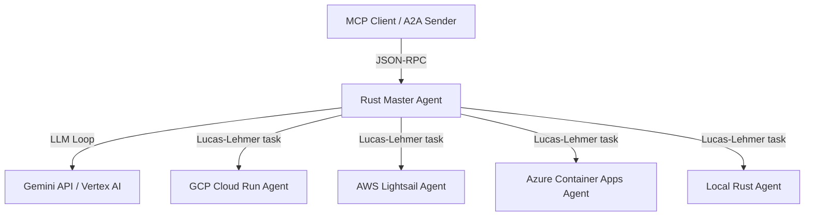

# Rust Master Coordinator Agent (`benchmark-rust-master`)

The **Master Coordinator Agent** is the central orchestrator in the Agent-to-Agent (A2A) Multi-Cloud Benchmark system. It is responsible for managing, health-checking, and delegating prime calculation tasks across multiple cloud and local sub-agents. 

This agent supports both the **Model Context Protocol (MCP)** and the **A2A Protocol**, exposing tools to run coordinated benchmarks, query agent health, and consult a local LLM-based agent coordinator.

---

## 📂 Project Structure

- **[src/main.rs](file:///home/xbill/a2a-multicloud/rust-master/src/main.rs)**: The core implementation containing A2A endpoints, MCP standard input/output and HTTP handlers, the Gemini LLM coordinator loop, and the distributed benchmark execution logic.
- **[Cargo.toml](file:///home/xbill/a2a-multicloud/rust-master/Cargo.toml)**: Cargo configuration specifying Rust 2024 edition and dependencies (`axum`, `tokio`, `reqwest`, `serde`, `chrono`).
- **[Makefile](file:///home/xbill/a2a-multicloud/rust-master/Makefile)**: Build, start, and query automation targets.
- **[benchmark_results.json](file:///home/xbill/a2a-multicloud/rust-master/benchmark_results.json)**: JSON output file containing metrics from the latest benchmark run.

---

## ⚙️ Architecture & Features



### 1. Protocols Supported
- **Agent-to-Agent (A2A) Protocol**: Implements `GET /.well-known/agent-card.json` (also mapped to `/.well-known/agent.json`) for agent capabilities, and a `POST /` endpoint supporting the `message/send` JSON-RPC method.
- **Model Context Protocol (MCP)**: Implements the `2024-11-05` protocol version.
  - **Stdio Transport**: Executing with `--stdio` processes JSON-RPC messages synchronously over standard input and output.
  - **HTTP Transport**: Exposes `POST /mcp` and `POST /mcp/` endpoints for synchronous JSON-RPC.

### 2. Gemini Coordinator Loop
For complex tasks or general queries, the master agent initiates a loop with the Gemini API:
- It declares sub-agents (`rust_agent`, `gcp_agent`, `aws_agent`, `azure_agent`) as Gemini function tools.
- Gemini can call these tools to delegate calculations or ask check questions.
- The master agent executes the tool by calling the corresponding sub-agent over the A2A protocol and feeding the result back to Gemini.

### 3. Distributed Benchmark Coordinator
When executing a benchmark:
- Cycles through available sub-agents (AWS, GCP, Azure, and Local).
- Performs status checks on each to verify readiness.
- Automatically handles Google OIDC token authentication for secure GCP Cloud Run invocations.
- Assesses exponent primality using Lucas-Lehmer tests run by sub-agents.
- Captures ready latency, calculation duration, and saves full run history to disk.

---

## 🔌 Environment Variables

Configure these variables before starting the master agent:

| Environment Variable | Description | Default |
|---|---|---|
| `PORT` | Local HTTP server port | `8100` |
| `MODEL_NAME` | Gemini model name | `gemini-2.5-flash` |
| `GOOGLE_GENAI_USE_VERTEXAI` | Set to `1` to run via GCP Vertex AI, `0` for Google AI Developer | `0` |
| `GEMINI_API_KEY` | API key (required when not using Vertex AI) | *None* |
| `GOOGLE_CLOUD_PROJECT` | GCP Project ID (required for Vertex AI) | *None* |
| `GOOGLE_CLOUD_LOCATION` | GCP location (required for Vertex AI) | `us-central1` |
| `GCP_ACCESS_TOKEN` | Bearer token for Vertex AI (auto-resolved via `gcloud` if unset) | *None* |
| `GCP_ID_TOKEN` | OIDC identity token for GCP sub-agent | *None* |
| `RUST_AGENT_URL` | Local Rust agent endpoint | `http://127.0.0.1:8104` |
| `GCP_AGENT_URL` | GCP Cloud Run agent endpoint | *Pre-configured URL* |
| `AWS_AGENT_URL` | AWS Lightsail agent endpoint | *Pre-configured URL* |
| `AZURE_AGENT_URL` | Azure Container Apps endpoint | *Pre-configured URL* |

---

## 🛠️ Commands & Development

### 1. Build
To compile the package:
```bash
make build
```

### 2. Start
To run the server locally on port `8100`:
```bash
make start
```

To run as an MCP server using `stdio` transport:
```bash
cargo run -- --stdio
```

> [!WARNING]
> When running in `--stdio` mode, all tracing logs are printed to `stderr` to avoid corrupting the standard output (`stdout`) transport channel.

### 3. Test & Quality
To run unit tests:
```bash
make test
```
To run format and clippy checks:
```bash
make lint
```

### 4. Direct Queries
Verify the running server with these helper scripts:
```bash
# Get local URL
make endpoint

# Query capability card
make card

# Test status endpoint via A2A
make a2a
```

---

## 🛠️ MCP Tools Exposed

When connected as an MCP server, the master agent registers the following tools:

1. **`ask_master_agent(query: String)`**:
   Asks the coordinator agent a general question. Leverages the Gemini coordinator loop under the hood to invoke sub-agents if needed.
2. **`calculate_mersenne_prime(n: i64)`**:
   Calculates and verifies Mersenne primes ($2^p - 1$) for exponents up to $n$. Delegates calculations across the cloud agents and local agent, printing a detailed timing report.
3. **`check_agents_status()`**:
   Pings all registered sub-agents to check their connectivity, printing a health checklist.
